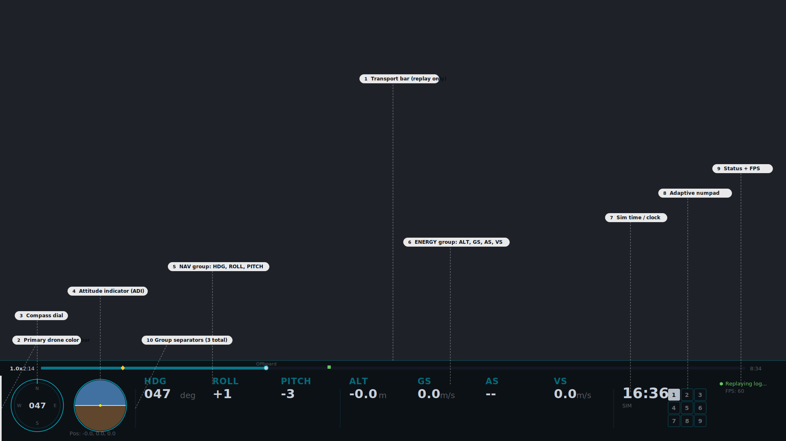
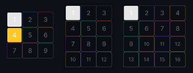
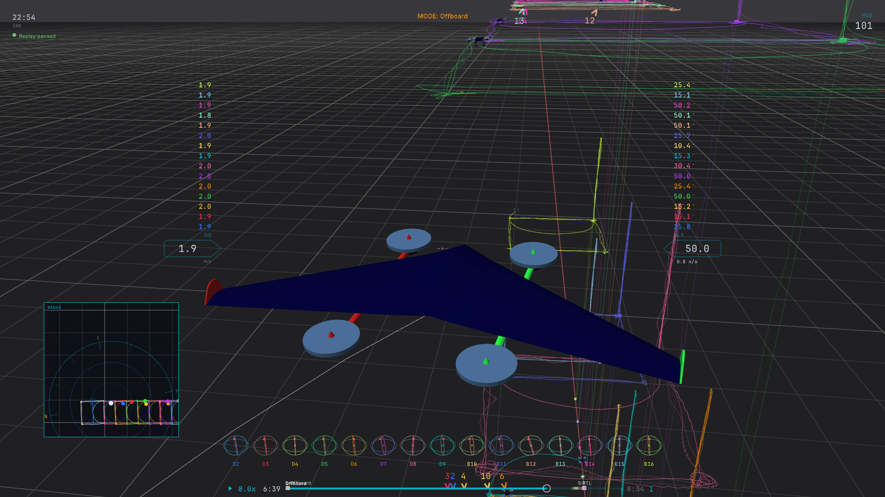
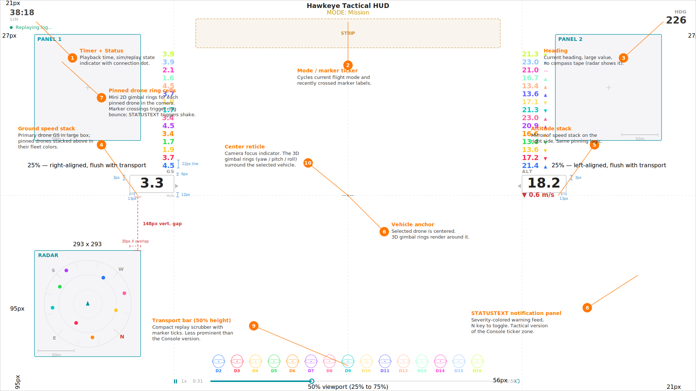
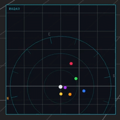
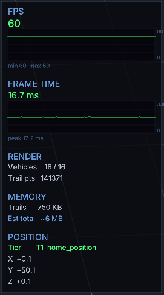
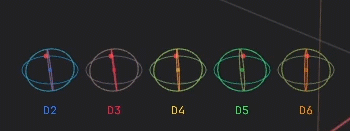
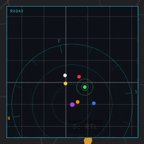
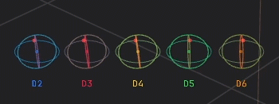

# Heads-up Display (Hawkeye)

Hawkeye has three Heads-up Display (HUD) modes plus a separate debug overlay.
Press `H` to cycle through **Console → Tactical → Off → Console**.
Press `Ctrl+D` to toggle the debug overlay on top of any mode.

- **Console** (default) is a rich telemetry overlay with transport bar, numpad, and pinned drone sidebar.
  Best for analysis and debugging.
- **Tactical** is a minimal floating HUD with heading-up radar and 3D gimbal rings.
  Best for screen recording and cinematic playback.
- **Off** hides the HUD entirely.
  Best for clean screenshots.

All HUD modes respect the active theme: colors, fonts, and layout adapt automatically.

## Console HUD

The default HUD.
Visible on first launch.

_<!-- 06-dia-01: annotated Console HUD with callouts for every region. SVG, 1920×1080. -->_

### Telemetry rows

A row of seven numeric values anchored to the bottom of the screen:

- **HDG:** heading (0 to 360°, compass convention)
- **ROLL:** roll angle (°)
- **PITCH:** pitch angle (°)
- **ALT:** altitude above origin (m)
- **GS:** ground speed (m/s)
- **AS:** airspeed (m/s, fixed-wing and VTOL only)
- **VS:** vertical speed (m/s, positive climbing)

Press `Y` to toggle the HDG display between heading (0–360, compass convention) and yaw (±180, math convention).

### Attitude indicator and compass strip

An attitude indicator (artificial horizon) sits at the bottom-left, showing roll and pitch visually.
A heading tape with tick marks runs along the bottom for quick reference.

### Numpad and pin sidebar

In multi-drone scenes, a numpad appears at the bottom-left.
Press a number key to select that drone; hold `Shift` plus a number to pin a drone to the HUD sidebar on the right.

The numpad layout adapts to drone count:

_<!-- 06-img-03: 3×3 vs 3×4 vs 4×4 triptych. -->_

- ≤9 drones: **3×3** grid, single-digit direct select
- 10 to 12 drones: **3×4** grid with smaller font
- 13 to 16 drones: **4×4** grid

Drones 10–16 are selected via a two-digit chord: press both digits within 300 ms.
For example, to select drone 12, press `1` then `2` quickly.
Shift plus the same chord toggles pinning.

### Transport bar

In replay mode, a transport bar runs along the bottom of the HUD showing:

- Playhead position with current time
- Scrubber for seeking
- Marker ticks for every marker in the flight (from all loaded drones; non-selected drones dimmed)
- Playback speed indicator

See [ULog Replay](replay.md) for the complete replay control reference.

### Status indicators

The Console HUD surfaces several status badges:

- **Tier badge:** current position data reliability (T1 / T2 / T3).
  See [Position Data Tiers](reference.md#position-data-tiers).
- **ESTIMATED POSITION** warning, shown when the reference frame is falling back to estimated origin.
- **CONF / PRSN / RMSE badges:** correlation statistics, visible when a secondary drone is pinned.
  See [Correlation Analysis](multi_drone.md#correlation-analysis).

### STATUSTEXT ticker

When replaying ULogs with logging messages (severity WARNING or worse), a message ticker appears above the HUD bar.
Press `N` to toggle it on or off.

### Font scaling

HUD text has minimum readable sizes at small window widths.
At resolutions below 1280×720, label alpha is reduced slightly for contrast but all text remains legible.
Don't rely on this behavior below 640×480; that's well outside the design target.

## Tactical HUD

An alternative HUD mode designed for cinematic playback and screen recording.
Minimal, floating, and focused on the selected vehicle.

_<!-- 06-img-01: tactical HUD overview, hero shot for the mode. -->_

A more comprehensive view showing all tactical HUD elements active at once (multi-drone scene with pinned ring cells, radar panel, ticker, transport bar, gimbal rings, GS/ALT stacks):

_<!-- 06-dia.png: tactical HUD with every feature visible at once. -->_

_<!-- 06-dia-02: annotated Tactical HUD with callouts for every region. SVG, 1920×1080, derived from docs/tactical-wireframe.svg. -->_

Press `H` from Console to enter Tactical.
The camera smoothly zooms to a close chase distance on entry and restores when you exit.

_<!-- 06-gif-01: H key transition, 4s. -->_

### Floating corner tags

Ground speed and altitude are displayed as large floating tags flanking the center of the screen.
No other telemetry rows; Tactical is intentionally sparse.

### Heading-up radar

A 2D radar panel shows all drones as colored blips relative to the selected drone's heading (forward is up).
A range ring indicates the visible distance scale.
In multi-drone scenes with a pinned drone, the correlation line renders directly on the radar in the pinned drone's color.

_<!-- 06-gif-03: 4 drones, radar blips update, 6s. -->_

### Gimbal rings

Three concentric 3D rings drawn around the selected vehicle represent yaw, pitch, and roll.
Each ring has tick marks at key angles and a directional pyramid pointer.

_<!-- 06-gif-02: drone rolling and pitching, rings rotate smoothly, 4s. -->_

In multi-drone scenes with pinned drones, mini 2D ring cells appear in a corner bar, one per pinned drone.

### Ortho insets

Press `O` while in Tactical to add compact ortho view panels (top / front / right) at the top or bottom edge.
Useful for keeping spatial context visible without switching cameras.

### Ticker and transport bar

In Tactical mode, the STATUSTEXT ticker moves to a corner panel (bottom-right) so it doesn't dominate the view.
The transport bar renders at 50% height.

## Debug Overlay

Press `Ctrl+D` to toggle a performance and diagnostics overlay on the right side of the screen.
Independent of Console / Tactical, it can be enabled alongside either HUD mode (or with the HUD off entirely).

_<!-- 06-img-02: debug overlay visible, all regions labeled. -->_

Contents:

- **FPS:** live frame rate with a color-coded graph and the min/max seen in the current window
- **Frame time:** milliseconds per frame with matching graph, a 16.67 ms target line (60 FPS), and a peak tracker
- **Render stats:** active vehicle count and total trail points across all drones
- **Memory estimates:** trail buffer usage and approximate total footprint
- **Position:** XYZ of the selected drone (Raylib draw-space coordinates) with a `BAD REF` warning if the reference frame is suspect
- **Position data tier:** T1 / T2 / T3 indicator with full label

Colors adapt to the active theme.
Use the debug overlay when diagnosing performance issues, verifying position reference, or checking memory footprint before sharing a replay session.

## Annunciators

Annunciators are subtle HUD animations that draw attention to events without interrupting playback.
Five animations ship built-in, each keyed to a specific event type and HUD mode.

| Annunciator          | HUD mode | Triggered by                              |
| -------------------- | -------- | ----------------------------------------- |
| Console tab fade     | Console  | Marker crossing (any drone)               |
| Gimbal ring bounce   | Tactical | Marker crossing (pinned drone)            |
| Radar droplet wave   | Tactical | Marker crossing (any drone)               |
| Ticker warning flash | Either   | STATUSTEXT ≤ WARNING severity             |
| Ring shake           | Tactical | STATUSTEXT ≤ WARNING severity (per drone) |

### Console tab fade

When playback crosses a marker, the affected drone's color bar in the Console sidebar double-pulses: fades out, fades back in, then pulses once more at smaller amplitude.

_<!-- 06-gif-04: marker crossed during playback, drone's left color bar double-pulses. 4s. -->_

### Gimbal ring bounce

In Tactical mode, a marker crossing for a pinned drone bounces that drone's gimbal ring cell vertically: two cycles, the second smaller.

_<!-- 06-gif-05: tactical view with pinned drone, marker crossed, cell bounces. 4s. -->_

### Radar droplet wave

A marker crossing sends two expanding concentric rings outward from the affected drone's radar blip, like a droplet on water.
Lets you spatially locate the event on the radar.

_<!-- 06-gif-06: marker crossed, rings expand from blip. 4s. -->_

### Ticker warning flash

When a new STATUSTEXT arrives during ULog replay, its ticker entry's background brightens and the text inverts briefly before returning to normal.
Unmissable attention for new warnings.

_<!-- 06-gif-07: STATUSTEXT arrives, ticker entry flashes. 4s. -->_

### Ring shake

STATUSTEXT warnings for a specific drone oscillate that drone's gimbal ring cell horizontally: three cycles at low amplitude.
Associates the warning with the specific drone, without needing to read the ticker text.

_<!-- 06-gif-08: STATUSTEXT arrives for a specific drone, cell oscillates. 4s. -->_
