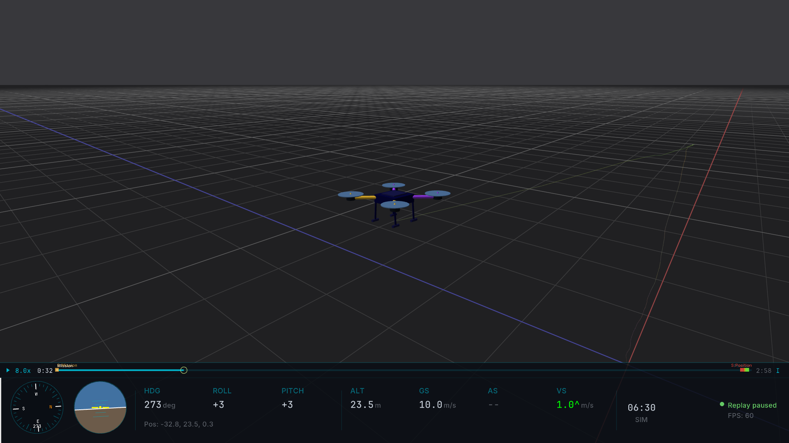

# Hawkeye

**Rapid Lightweight Visualizer** for PX4. Hawkeye renders live SITL telemetry, replays PX4 ULog flight logs, and supports multi-drone swarm analysis with correlation tracking, takeoff alignment, and deconfliction, up to 16 vehicles simultaneously.

<video src="https://github.com/user-attachments/assets/PLACEHOLDER-HERO-VIDEO" autoplay loop muted playsinline></video>

_<!-- 01-vid-01: hero banner. Multi-drone swarm mid-flight, tactical HUD on, correlation curtain between two drones, smooth camera sweep. 10 to 15 seconds. -->_

Built on [Raylib](https://www.raylib.com/) and [MAVLink](https://mavlink.io/), Hawkeye is lightweight, cross-platform, and has zero runtime dependencies. Just build and fly.

## Features

- **Real-time 3D visualization:** vehicle position and attitude driven by MAVLink telemetry
- **Multi-vehicle swarm support:** up to 16 vehicles simultaneously, with automatic deconfliction and formation, ghost, or grid offset modes
- **ULog replay:** load one or more `.ulg` files and replay swarm flights side by side
- **Correlation analysis:** real-time Pearson correlation and RMSE between pinned drones, with correlation line and 3D curtain overlays
- **CUSUM takeoff alignment:** automatically detects launch moments and synchronizes multi-drone timelines
- **Tactical HUD:** alternative minimal HUD with heading-up radar, gimbal rings, and ortho insets for cinematic playback
- **Frame markers:** drop labeled markers during replay, navigate between them, or cycle across all drones
- **Theme engine:** drag-and-drop `.mvt` theme files for customized visual modes
- **Cross-platform:** macOS, Linux, and Windows, shipped as Homebrew, `.deb`, and source builds



_<!-- 01-img-01: clean Console HUD screenshot, single drone mid-flight. Used as the feature-bullet illustration. 1920×1080. -->_

## Installation

Hawkeye ships as a Homebrew formula on macOS, a `.deb` package on Debian/Ubuntu, and as a source build on all three major platforms.

### macOS (Homebrew)

```sh
brew tap PX4/px4
brew install PX4/px4/hawkeye
```

After install, the `hawkeye` binary is on your `PATH`. Launch it from any terminal:

```sh
hawkeye
```

### Linux (Debian/Ubuntu)

Download the latest `.deb` from the [Hawkeye releases page](https://github.com/PX4/Hawkeye/releases/latest) and install it:

```sh
sudo dpkg -i hawkeye-*.deb
```

ARM64 builds (Raspberry Pi, Jetson, cloud ARM instances) are published in the same release.

### Building from source

Required on Windows, optional on macOS and Linux if you want the latest development builds.

::: info Clone with `--recursive`. Hawkeye uses the MAVLink `c_library_v2` as a submodule. If you forget and hit `fatal: destination path 'c_library_v2' already exists and is not an empty directory`, fix it with `git submodule update --init`. :::

#### macOS

```sh
brew install cmake git
git clone --recursive https://github.com/PX4/Hawkeye.git
cd Hawkeye
make release
```

#### Linux (Debian/Ubuntu)

```sh
sudo apt-get install -y cmake git build-essential \
  libgl1-mesa-dev libx11-dev libxrandr-dev \
  libxinerama-dev libxcursor-dev libxi-dev

git clone --recursive https://github.com/PX4/Hawkeye.git
cd Hawkeye
make release
```

#### Windows

Requires [Visual Studio 2022](https://visualstudio.microsoft.com/) with the "Desktop development with C++" workload, [CMake](https://cmake.org/download/), and [Git](https://git-scm.com/).

```powershell
git clone --recursive https://github.com/PX4/Hawkeye.git
cd Hawkeye
make release
```

### Binary location

After a source build, the binary is at:

| Platform | Path                        |
| -------- | --------------------------- |
| macOS    | `build/hawkeye`             |
| Linux    | `build/hawkeye`             |
| Windows  | `build\Release\hawkeye.exe` |

### Makefile targets

| Target         | Description                 |
| -------------- | --------------------------- |
| `make`         | Debug build (default)       |
| `make release` | Release build               |
| `make test`    | Build and run all tests     |
| `make run`     | Build and launch the viewer |
| `make clean`   | Remove the build directory  |

### Verifying the install

Launch Hawkeye with no arguments:

```sh
./build/hawkeye     # source build
hawkeye             # package install
```

A window opens with the default quadrotor model on a grid backdrop, waiting for MAVLink telemetry on UDP port 19410.

_<!-- 02-img-01: first-launch window, default quad, grid theme, waiting-for-MAVLink state. 1280×720. -->_

If the window doesn't appear or you hit a build error, see [Troubleshooting](../troubleshooting.md).

## Getting Started

Three progressive paths, each standalone. Pick whichever matches what you have on hand. No PX4 source build required for replay, no log files required for live SITL.

::: tip Press `?` at any time in Hawkeye to open the help overlay with the full keybind reference. This is the fastest way to discover what the viewer can do. :::

### First run with PX4 SITL

The shortest path from install to seeing a vehicle move. Requires a PX4-Autopilot source tree.

**Terminal 1, start PX4 SIH:**

```sh
cd PX4-Autopilot
make px4_sitl sihsim_quadx
```

**Terminal 2, launch Hawkeye:**

```sh
hawkeye
```

A quadrotor appears in the Hawkeye window, sitting at the origin. In the PX4 shell (Terminal 1), arm and take off:

```
commander takeoff
```

Watch Hawkeye. The vehicle arms, lifts off, and the HUD numbers at the bottom of the screen update in real time. Ground speed, altitude, heading, and attitude all flow directly from PX4's MAVLink telemetry.

_<!-- 03-gif-01: arm, takeoff, HUD numbers updating. 4–5s. -->_

Left-drag to orbit the camera around the vehicle. Press `C` to cycle between Chase, FPV, and Free camera modes. Press `?` at any time to see the full keybind reference.


_<!-- 03-img-02: keybind cheat sheet shown by `?` key. -->_

That's it. You're flying.

### Your first replay

For users with an existing PX4 ULog (`.ulg`) file. No PX4 source tree required.

```sh
hawkeye --replay path/to/flight.ulg
```

Hawkeye opens, pre-scans the log for vehicle type and flight mode transitions, prints a summary to the console, and starts playing the flight automatically:

```
ULog replay: flight.ulg (287.3s, 289 index entries)
  Flight modes: Takeoff@12s Mission@15s RTL@250s Land@276s
  Takeoff: 12.3s (CUSUM conf=92%)
```

Use the transport keys to navigate:

| Key                   | Action                             |
| --------------------- | ---------------------------------- |
| `Space`               | Pause / resume                     |
| `+` / `-`             | Increase / decrease playback speed |
| `←` / `→`             | Seek 5 seconds                     |
| `Shift+←` / `Shift+→` | Frame step (20 ms)                 |
| `R`                   | Restart from beginning             |

See the [ULog Replay](replay.md) section for the full list of transport controls, marker keybinds, and analysis features.

### Your first swarm

For users comparing multiple ULog files. The biggest visual payoff.

```sh
hawkeye --replay drone1.ulg drone2.ulg drone3.ulg
```

Hawkeye pre-scans each log and decides how to lay out the drones in the scene. If the logs have clean, compatible home positions and no conflicts, drones render in **Formation mode** at their real GPS positions automatically. No prompt, playback starts right away.

If Hawkeye detects a conflict (shared launch point, drones more than 1 km apart, or missing position data), it shows a **deconfliction prompt** before playback starts with three resolution modes:


_<!-- 07-img-02: deconfliction prompt UI with the three resolution modes. -->_

- **Ghost:** non-primary drones rendered at 35% opacity. Best for before/after comparison of the same mission.
- **Grid Offset:** drones spaced +5 m apart for visual separation. Best when drones share a launch point.
- **Narrow Grid:** drones from distant locations collapsed to one view. Best for comparing flights from different test sites.

Pick one with arrow keys and Enter. All drones now replay together. Formation isn't in this list because it wouldn't produce a sensible view when conflicts exist; it's only available automatically when no conflict is detected.

During playback, try:

- `T` cycles trail rendering modes
- `Shift+T` cycles correlation overlays (line, curtain)
- `A` toggles takeoff alignment (synchronize all drones to their detected takeoff moments)
- `Shift+1` through `Shift+9` pins a secondary drone to the HUD sidebar for correlation statistics
- `P` cycles the view mode (Formation / Ghost / Grid Offset / Narrow Grid), with Formation skipped if conflicts were detected at load time

See [Multi-Drone Replay](multi_drone.md) for the full walkthrough.

### Where to go next

You now have the basics. The rest of this guide covers each major feature area in depth:

- [The HUD](hud.md) for Console and Tactical HUD modes, debug overlay, and annunciators
- [In-World Indicators](world_indicators.md) for trails, ground track, correlation line, and correlation curtain
- [Cameras and Views](views.md) for camera modes, orthographic panels, themes, vehicle models, and edge indicators
- [ULog Replay](replay.md) for single-log replay, transport controls, and markers
- [Multi-Drone Replay](multi_drone.md) for loading multiple logs, deconfliction, takeoff alignment, and correlation analysis
- [Live SITL Integration](sitl.md) for single-vehicle and multi-instance swarm workflows with PX4 SITL
- [Command-Line Reference](cli.md) for every CLI flag with examples
- [Reference](reference.md) for keyboard shortcuts, position data tiers, and coordinate systems
- [Troubleshooting](troubleshooting.md) for build errors, missing telemetry, and edge cases
