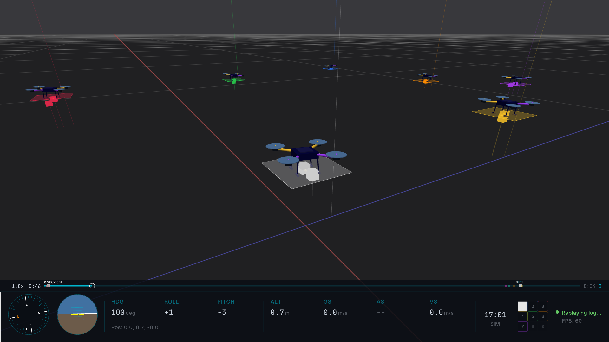
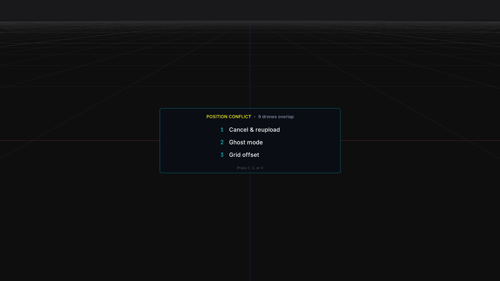
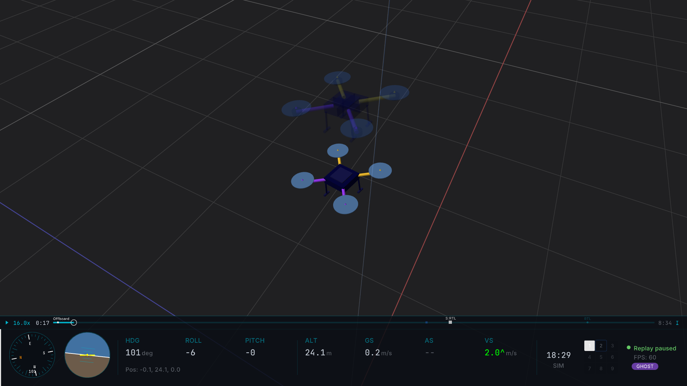
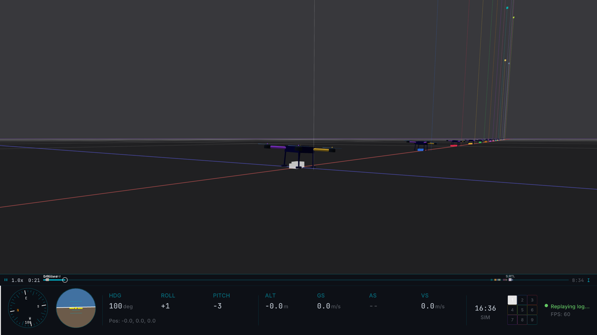
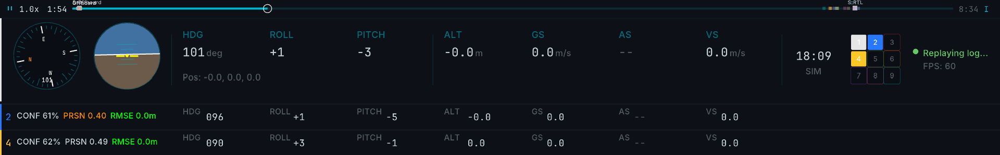

# Multi-Drone Replay

Hawkeye loads up to 16 ULog files simultaneously and replays them together as a coordinated swarm. This page covers the multi-drone-specific features: deconfliction when drones have different launch points, CUSUM-based takeoff alignment, and real-time correlation statistics between pinned drones.

For single-log replay basics and the transport controls, see [ULog Replay](replay.md).

## Loading multiple logs

```sh
hawkeye --replay drone1.ulg drone2.ulg drone3.ulg
```

Up to 16 files are supported. Each becomes a replay-backed vehicle in the scene, with its own trail, markers, and telemetry. Hawkeye pre-scans every log (as with single-log replay) and additionally checks for conflicts between them.

_<!-- 07-vid-01: 15-20s. Terminal command → app opens → pre-scan console output → if conflicts detected, deconfliction prompt appears, user picks a mode → drones replay. -->_

## Deconfliction

On load, Hawkeye compares the home positions of every loaded log and checks for three kinds of conflict that would break a shared-origin view:

- **Shared launch point:** two or more drones with identical or near-identical home positions. They would render on top of each other.
- **Geographic spread > 1 km:** drones launched from very distant locations. They would be scattered across an unreasonably large viewing area.
- **Missing position data:** one or more logs have neither `home_position` nor `vehicle_global_position`. See [Position Data Tiers](reference.md#position-data-tiers) for what happens in this fallback case.

### Default: Formation (no conflict)

When the loaded drones have clean, compatible home positions and no conflicts are detected, Hawkeye uses **Formation mode** automatically. Drones render at their real GPS positions in a shared NED coordinate system, with colored home position markers at each launch site. No prompt appears, playback starts immediately.



_<!-- 07-img-03: three drones at real GPS positions, home markers visible. -->_

Formation is the correct mode for coordinated swarms that actually flew together. It's also the only mode that preserves real-world geometric relationships between drones.

Formation mode cannot be selected manually if conflicts are detected; it's only available when it would produce a sensible view. If you want Formation on conflicting logs, you'd have to resolve the conflict at the data level (for example, by regenerating home positions).

### Conflict detected: deconfliction prompt

If any conflict is detected, a **deconfliction prompt** appears before playback starts, offering three resolution modes:



_<!-- 07-img-02: deconfliction prompt UI showing the three resolution modes. -->_

#### Ghost

Non-primary drones render at 35% opacity with a color tint. The primary drone is fully opaque.

Use when comparing two (or more) flights of the same mission, e.g., before/after a PID tuning change, or two pilots flying the same waypoint pattern.



_<!-- 07-img-04: two flights overlaid, one opaque + one 35% tinted. -->_

You can also force Ghost mode from the command line without a prompt:

```sh
hawkeye --ghost before.ulg after.ulg
```

#### Grid Offset

Each drone is shifted by +5 meters along the X axis for visual separation. All drones use the primary drone's origin as a reference point.

Use when drones share a launch point (which is what would have triggered Formation's conflict detection in the first place) but you still want to see their individual paths without overlap.



_<!-- 07-img-05: drones separated by +5m offsets, labeled. -->_

#### Narrow Grid

Collapses drones from geographically distant locations into the same view area with 1-meter spacing.

Use when comparing flights from entirely different test sites, where the drones have nothing in common geographically, but you want to compare their trajectories side by side.

_<!-- 07-img-06: drones from different locations collapsed to same view with 1m spacing. -->_

### Switching modes mid-replay

Press `P` at any time during multi-drone playback to cycle the view mode. The available modes depend on whether the logs had conflicts at load time:

- **No conflict at load:** `P` cycles Formation → Ghost → Grid Offset → Narrow Grid → Formation. All four modes are available.
- **Conflict detected at load:** `P` cycles Ghost → Grid Offset → Narrow Grid → Ghost. Formation is excluded because the conflict that prevented it at load time is still present.

Use `P` to flip between modes for different visual comparisons without reloading the logs.

## Takeoff Alignment

Drones in a swarm rarely log their start at the same wall-clock time. Drone A might have powered on five seconds before takeoff; Drone B powered on twelve seconds before takeoff. Played back naively, Drone A appears to take off at playback time 5 s while Drone B takes off at playback time 12 s, visually unsynchronized even though both launched simultaneously in real life.

Press `A` to toggle **takeoff alignment**.

_<!-- 07-gif-03: before = drones at different playback positions, after = all drones synchronized at takeoff moment. 8s. -->_

With alignment on, each drone's timeline is shifted so `t = 0` corresponds to its detected takeoff moment. All drones now appear to lift off simultaneously. Press `A` again to return to absolute log timestamps.

### How takeoff is detected

Hawkeye runs a CUSUM (cumulative sum control chart) algorithm over each log's vertical velocity:

1. Track vertical velocity deviations above a 0.3 m/s drift allowance (values below this are considered sensor noise).
2. Accumulate those deviations. When the running sum crosses a threshold, that moment is flagged as a takeoff event.
3. Corroborate with flight mode transitions. If the drone also transitions into Takeoff, Mission, or Auto mode near the CUSUM event, confidence is higher.

### Confidence scores

Each detected takeoff has a confidence score shown as the **CONF** badge in the HUD:

- **70 to 100%:** clean CUSUM trigger with a sharp vertical velocity jump and a corroborating mode change
- **30 to 70%:** CUSUM detected but without a sharp jump or mode corroboration
- **0 to 30%:** fallback heuristic from flight mode transitions only (no CUSUM trigger)
- **Blank:** no takeoff detected (drone was already airborne at log start, or log is pure hover)

Low confidence scores are informational, not errors. Alignment still works at low confidence; it just means the detected moment may be slightly off from the actual takeoff.

## Correlation Analysis

When comparing two drones (same mission flown twice, or two drones in formation), you often want quantitative measurements of how similar their trajectories are. Correlation analysis provides real-time Pearson correlation and RMSE statistics during playback.

### Activating correlation

1. Load a multi-drone replay.
2. Select a primary drone with a number key or `TAB`.
3. Pin a secondary drone with `Shift+1` through `Shift+9`.
4. PRSN / RMSE / CONF badges appear in the Console HUD sidebar.



_<!-- 07-img-07: HUD sidebar showing PRSN/RMSE/CONF badges with example values. -->_

### The metrics

- **PRSN** is the Pearson correlation coefficient on 3D position. 1.0 means the drones' movements are perfectly correlated (tracking together); 0 means uncorrelated; negative values mean inversely correlated. Updates in real time as the flight progresses.
- **RMSE** is the root mean square position error in meters, the absolute distance deviation between the two drones' paths. Lower means closer tracking.
- **CONF** is the CUSUM takeoff confidence (from [Takeoff Alignment](#takeoff-alignment)). It's context for interpreting PRSN/RMSE: if the detected takeoff times are low-confidence, the alignment may be slightly off and the correlation metrics will reflect that.

### Visual overlays

Press `Shift+T` to cycle 3D correlation overlays between the selected and pinned drones:

| Mode    | Rendering                                                               |
| ------- | ----------------------------------------------------------------------- |
| Off     | No overlay                                                              |
| Line    | Direct 3D line between the two drones' current positions                |
| Curtain | Semi-transparent ruled surface spanning the two drones' trail histories |

Both overlays are diegetic; they render inside the 3D scene alongside the trails. See [Correlation Overlays](world_indicators.md#correlation-overlays) for the full visual explanation.

For multi-drone scenes where you want to visually track which drone is which (regardless of correlation), use **trail mode 3 (drone color)**. Press `T` to cycle, and each drone renders its trail in its fleet palette color. See [Drone color trail](world_indicators.md#drone-color-trail-mode-3) for details.

## Next steps

- [ULog Replay](replay.md) for single-log basics, transport controls, and markers (markers work in multi-drone too)
- [The HUD](hud.md) for Console vs Tactical HUD modes and annunciators that fire on marker crossings and STATUSTEXT events
- [Live SITL Integration](sitl.md) for multi-instance SITL swarm setup with live telemetry
- [Reference](reference.md) for keyboard shortcuts, position data tiers, and coordinate systems
