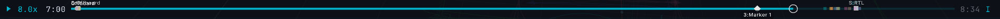
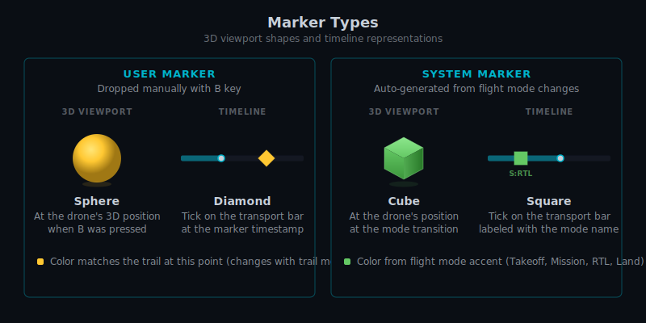
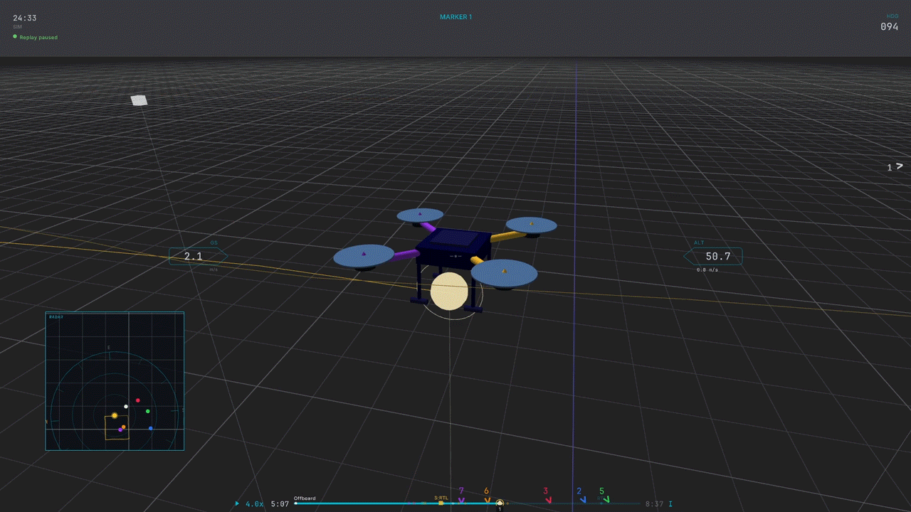

# ULog Replay (Hawkeye)

Hawkeye replays PX4 ULog (`.ulg`) flight logs as interactive 3D playback. This page covers single-log replay: loading a file, navigating with the transport controls, and dropping markers. For multi-drone analysis (multiple logs loaded together, takeoff alignment, correlation statistics), see [Multi-Drone Replay](../sim_hawkeye/multi_drone.md).

## Loading a log

```sh
hawkeye --replay path/to/flight.ulg
```

On launch, Hawkeye opens the file, parses its header, pre-scans the entire flight to build a timestamp index and detect vehicle type, flight mode transitions, and the takeoff moment. It then prints a summary and starts playing:

```
ULog replay: flight.ulg (287.3s, 289 index entries)
  Flight modes: Takeoff@12s Mission@15s RTL@250s Land@276s
  Takeoff: 12.3s (CUSUM conf=92%)
```


_<!-- 07-gif-01: command runs, console output scrolls, replay starts. 6s. -->_

### ULog topics consumed

Hawkeye reads these PX4 topics from the log:

| Topic                     | Required | Purpose                                 |
| ------------------------- | -------- | --------------------------------------- |
| `vehicle_attitude`        | yes      | Orientation quaternion                  |
| `vehicle_local_position`  | yes      | NED position, velocity                  |
| `vehicle_global_position` | no       | GPS latitude, longitude, altitude       |
| `vehicle_status`          | no       | Vehicle type, arming state, flight mode |
| `home_position`           | no       | Authoritative home location             |
| `airspeed_validated`      | no       | Airspeed sensor data                    |
| `logging`                 | no       | STATUSTEXT warnings                     |

Logs without GPS or home data fall back to local position with an estimated reference frame. See [Position Data Tiers](reference.md#position-data-tiers) for the trust hierarchy.

### Playback interpolation

ULog files typically record position at 5 to 10 Hz. Hawkeye interpolates between samples using dead-reckoning (velocity integration) to produce smooth playback at the display frame rate. This is on by default. Press `I` to toggle and see a toast confirmation. With interpolation off, you see the raw sample positions as a stairstep motion.

## Transport controls

The transport bar runs along the bottom of the Console HUD during replay. It shows the playhead, scrubber, and marker ticks for the full flight duration.



_<!-- 07-img-01: bottom-of-screen close-up with callouts for play/pause, scrubber, markers, time display, speed indicator. -->_

| Key                             | Action                             |
| ------------------------------- | ---------------------------------- |
| `Space`                         | Pause / resume                     |
| `+` / `-`                       | Increase / decrease playback speed |
| `←` / `→`                       | Seek 5 seconds backward / forward  |
| `Shift+←` / `Shift+→`           | Frame step (20 ms)                 |
| `Ctrl+Shift+←` / `Ctrl+Shift+→` | Seek 1 second                      |
| `R`                             | Restart from beginning             |
| `Shift+L`                       | Toggle loop                        |
| `I`                             | Toggle interpolation               |
| `L`                             | Toggle marker label visibility     |
| `Y`                             | Toggle HDG / YAW display           |

_<!-- 07-gif-02: seek, frame step, and pause in action. 6s. -->_

Playback speed cycles through `0.25×`, `0.5×`, `1×`, `2×`, `4×`, `8×` with `+` and `-`. The current speed displays in the HUD.

## Markers

Markers let you annotate specific moments during a flight: the takeoff, the point where a control mode changed, the moment of a failure. Each marker stores the 3D position, playback time, and an optional text label.


_<!-- 07-gif-06: press B, sphere appears. Press B then L, input opens, type "takeoff", Enter, label displays. 5s. -->_

### Dropping markers

| Key          | Action                                         |
| ------------ | ---------------------------------------------- |
| `B`          | Drop a marker at the current position and time |
| `B` then `L` | Drop a marker and open the label input         |
| `Shift+B`    | Delete the current marker                      |

When you drop a marker with `B`, a sphere appears at the drone's current 3D position, anchored to the current playback time. Press `B` then `L` in quick succession to drop a marker AND immediately open a text input for a label. Type up to 48 characters and press Enter.

Labels always face the camera (billboarding) and scale with distance so they stay readable at any zoom level.

### Navigating markers

| Key                   | Action                                                     |
| --------------------- | ---------------------------------------------------------- |
| `[` / `]`             | Previous / next marker of the selected drone               |
| `Ctrl+[` / `Ctrl+]`   | Previous / next marker across **all** drones (multi-drone) |
| `Shift+[` / `Shift+]` | Track from marker (see below)                              |
| `L`                   | Toggle marker label visibility                             |

Jumping to a marker with `[` or `]` seeks playback to that marker's time and keeps the current camera mode (Chase, FPV, or Free).

**Track from marker** (`Shift+[` / `Shift+]`) does something different: it seeks to the marker's time, moves the camera to the marker's 3D position, and switches to **Free camera mode**. This puts you at the exact spot where the marker was dropped, looking at the scene from that vantage point. Useful for inspecting what was happening at a specific location without the camera following the drone away from it.

### Marker types

Three visual types, distinguished by shape:



_<!-- 07-dia-01: SVG showing user sphere and system cube with timeline variants and color coding. -->_

- **User markers** render as 3D spheres in the viewport and diamonds on the timeline. Manually dropped with `B`.
- **System markers** render as 3D cubes and squares on the timeline. Auto-generated from ULog flight mode transitions (Takeoff, Mission, RTL, Land, etc.). Not user-editable.

### Marker colors

User marker colors are computed from the snapshotted telemetry at the marker's position (roll, pitch, vertical speed, ground speed) using the current trail mode and theme. If you switch trail modes, marker colors update to match: directional mode shows attitude-based colors, speed ribbon mode shows heat-gradient colors, drone color mode shows the fleet palette color. Switching themes also updates marker colors since the color palette comes from the theme.

System markers use distinct accent colors per mode transition type.

### Multi-drone marker navigation

In a multi-drone replay, each drone has its own marker list. The transport bar shows markers from all loaded drones interleaved, with non-selected drones' markers dimmed.

`[` and `]` cycle only the **selected** drone's markers. `Ctrl+[` and `Ctrl+]` cycle **globally** across all drones, interleaved by time.



_<!-- 07-gif-07: multi-drone replay, markers from all 3 drones visible, press ] then Ctrl+], highlight changes. 6s. -->_

## Next steps

Once you're comfortable with single-log replay, the big features are on the multi-drone side:

- [Multi-Drone Replay](../sim_hawkeye/multi_drone.md) for loading multiple logs, deconfliction, takeoff alignment, and correlation analysis
- [The HUD](../sim_hawkeye/hud.md) for Console vs Tactical modes and annunciators that fire on marker crossings
- [Command-Line Reference](../sim_hawkeye/cli.md) for all replay-related flags including `--ghost` for overlay comparison
