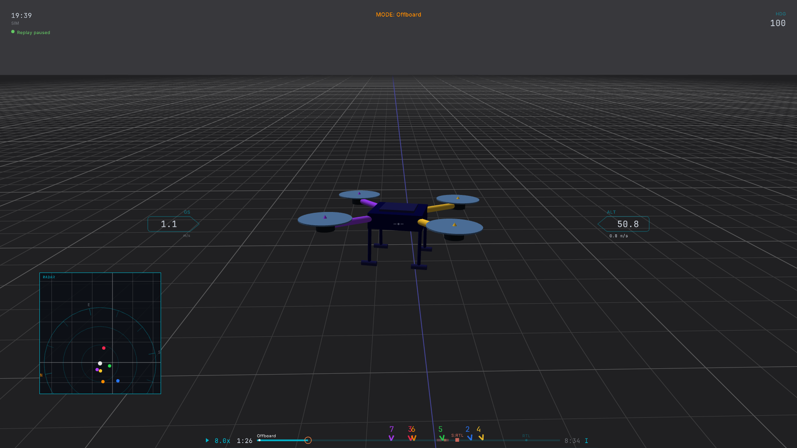
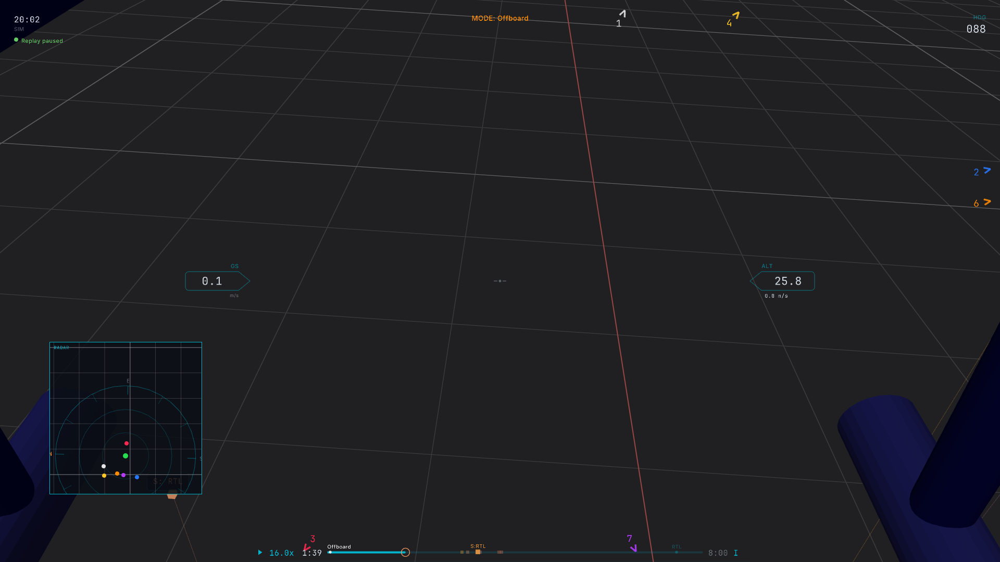
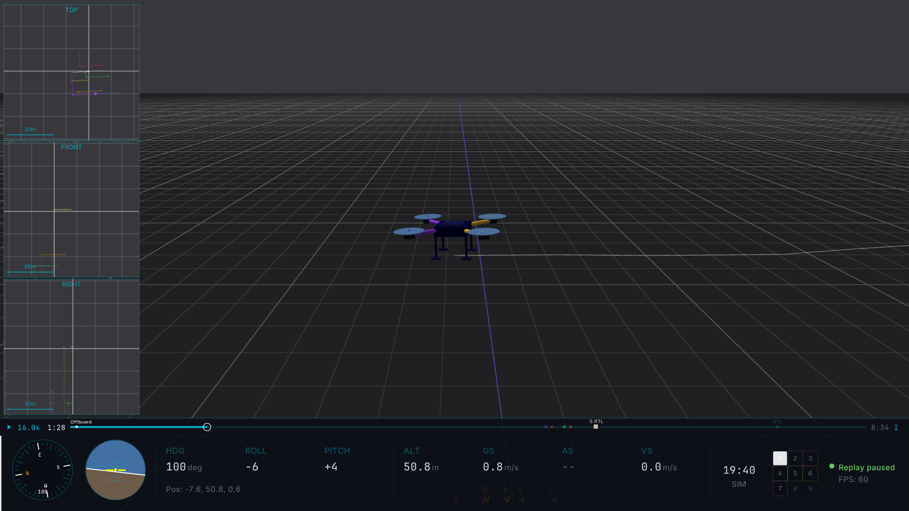
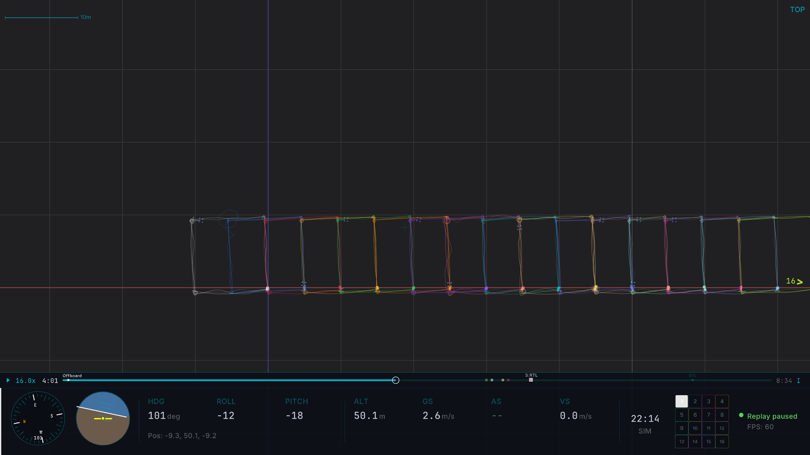
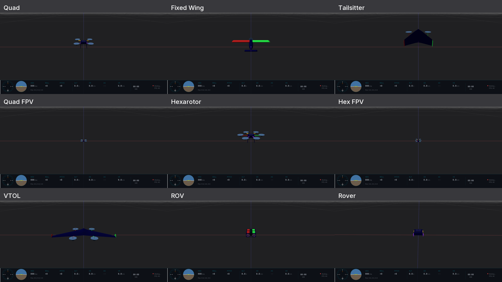
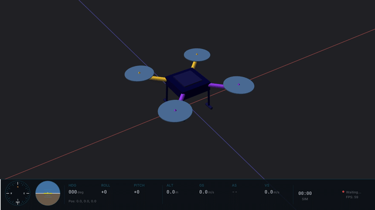

# Cameras and Views

Hawkeye offers three camera modes, two orthographic rendering options, a theme system for visual customization, and nine vehicle models. For the 3D world-space indicators (trails, ground track, correlation overlays), see [In-World Indicators](world_indicators.md).

## Camera Modes

Press `C` to cycle between the three camera modes: **Chase → FPV → Free → Chase**.

*<!-- 05-gif-01: camera cycle, 6s, Chase → FPV → Free with on-screen mode label. -->*

### Chase (default)

Third-person orbit camera that follows the selected vehicle from a fixed distance. Left-drag to rotate around the vehicle. Scroll wheel adjusts field of view.

Chase is the best mode for most flight review. It keeps the vehicle centered while letting you see the surrounding environment.

*<!-- 05-img-01: chase camera view of a single drone. -->*

### FPV

First-person view from the nose of the vehicle. The camera rotates with the vehicle's attitude: pitch up and the horizon tilts, roll and the world tilts with you.

Use FPV for understanding what the pilot (or autopilot) was seeing at any moment.

*<!-- 05-img-02: FPV nose-forward camera view. -->*

### Free

Untethered camera that ignores vehicle motion. Fly the camera manually:

| Input | Action |
|---|---|
| `W` / `S` | Forward / backward |
| `A` / `D` | Strafe left / right |
| `Q` / `E` | Descend / ascend |
| Mouse | Look around |
| `Shift` (held) | 3× boost on all motion |

Use Free mode to set up shots, inspect specific parts of the scene, or capture screenshots from arbitrary angles. Press `C` to return to Chase when you're done.

## Orthographic Views

Hawkeye supports orthographic projection (no perspective distortion) in two flavors: a compact sidebar panel with three views at once, and a fullscreen ortho camera for the main viewport.

### Sidebar ortho panel

Press `O` to toggle a right-side panel with three synchronized orthographic views:

- **Top**, plan view, looking down
- **Front**, looking north along the vehicle's path
- **Right**, looking east from the vehicle's right side

*<!-- 05-gif-03: press O, panel slides in, 3 views follow drone. 5s. -->*

Each panel has a scale bar, coordinate axis gizmo, and 2D trail rendering. The panels follow the selected vehicle automatically.

### Fullscreen ortho

Switch the main viewport to a fullscreen orthographic camera with `Alt+2` through `Alt+7`:

| Key | View |
|---|---|
| `Alt+1` | Return to perspective camera |
| `Alt+2` | Top |
| `Alt+3` | Front |
| `Alt+4` | Left |
| `Alt+5` | Right |
| `Alt+6` | Bottom |
| `Alt+7` | Back |

*<!-- 05-img-03: fullscreen ortho Top view with 2D trail and ground grid. -->*

In ortho mode:

- `Alt+Scroll` adjusts the visible world distance (span)
- Right-drag pans the view
- Side views (Front / Back / Left / Right) include a distance grid with adaptive spacing
- Top / Bottom views show a plan-view grid

## Themes

Hawkeye's visual appearance is driven by a theme system. Three themes ship built-in, and you can load custom `.mvt` theme files at runtime.

Press `V` to cycle themes: **Grid → Rez → Snow → Grid**.

*<!-- 05-gif-04: theme cycle, 5s, Grid → Rez → Snow. -->*

### Built-in themes

- **Grid** (default) is a debug-style grid with colored axes on a blue-tinted background. Best general-purpose theme.
- **Rez** is a teal grid on a black ground with a dark sky. High-contrast cyberpunk aesthetic, good for screen recording.
- **Snow** is a high-contrast outdoor mode with a bright white ground, dark grid lines, and black-outlined HUD text for visibility on low-nit displays in direct sunlight.

### Custom themes

Drag and drop any `.mvt` file onto the Hawkeye window to load it. The file is automatically copied to the `themes/` directory and added to the `V`-key cycle rotation.

::: tip
The web-based theme builder at [hawkeye.px4.io/theme-builder](https://hawkeye.px4.io/theme-builder) lets you edit every theme slot visually and export a ready-to-drop `.mvt` file. *(If the theme builder is not yet publicly hosted, this URL will be updated once it is.)*
:::

### Classic vs modern arm colors

Press `K` to toggle between **classic** (red port / blue starboard) and **modern** (yellow fore / purple aft) arm color presets. The toggle applies to all vehicle models that support role-based material assignment.

## Vehicle Models

Hawkeye ships nine 3D vehicle models:

*<!-- 05-img-04: all 9 vehicle models contact sheet, 3x3 grid, theme-neutral. -->*

| Model | Group | Typical use |
|---|---|---|
| Quadrotor | Quad | Default multicopter |
| FPV Quad | Quad | Racing / freestyle quadrotor |
| Hexarotor | Hex | Six-rotor payload platform |
| FPV Hex | Hex | Racing hexarotor |
| Fixed-wing | Fixed-wing | Conventional airplane |
| Tailsitter | Tailsitter | VTOL tailsitter |
| VTOL | VTOL | Tilt-rotor VTOL |
| Rover | Rover | Ground vehicle |
| ROV | ROV | Underwater vehicle |

### Automatic selection

In live MAVLink mode, Hawkeye reads the `HEARTBEAT` message's `MAV_TYPE` field and selects the appropriate model automatically. In ULog replay mode, the same information comes from the `vehicle_status` topic.

The `-mc`, `-fw`, and `-ts` command-line flags set a fallback group when no type information is available yet. See [Command-Line Reference](cli.md).

### Manual cycling

- `M` cycles through models within the **current group** (e.g., Quadrotor → FPV Quad → Quadrotor)
- `Shift+M` cycles across **all groups**, letting you visit every model regardless of the current vehicle type

*<!-- 05-gif-05: press M to cycle within group, 6s. -->*

### Theme-driven colors

Vehicle models use a role-based material system: arms tagged as **Port**, **Starboard**, **Fore**, and **Aft** pull their colors from the active theme. Switching themes instantly updates arm colors across all visible drones without reloading models.

Body, propeller, and motor colors also come from the theme, though these are more subtle and theme-to-theme differences are smaller.

## Edge Indicators

In multi-drone scenes, drones can drift off-screen when you zoom in on one or more vehicles. Press `Ctrl+L` to toggle **screen edge indicators**: colored chevrons pointing toward off-screen drones, labeled with each drone's number.

Edge indicators are **screen-space** (not world-space). They render on the HUD layer like a compass pointer, not inside the 3D scene. For world-space visualizations like trails and correlation overlays, see [In-World Indicators](world_indicators.md).

Indicators:

- Point from the screen edge toward the off-screen drone's actual world position
- Use the drone's fleet color for easy identification
- Show the drone's number inside the chevron
- Fade and resize based on distance off-screen

Use this with 4+ drone swarms when you're zoomed on one pinned drone but want to keep track of where the others are.

## Mouse Controls Summary

| Input | Action |
|---|---|
| Left-drag | Orbit camera (Chase) / look around (Free) |
| Scroll wheel | Zoom FOV (perspective) or span (ortho) |
| Right-drag | Pan view (ortho modes only) |
| `Alt+Scroll` | Zoom ortho span (faster than scroll alone) |
